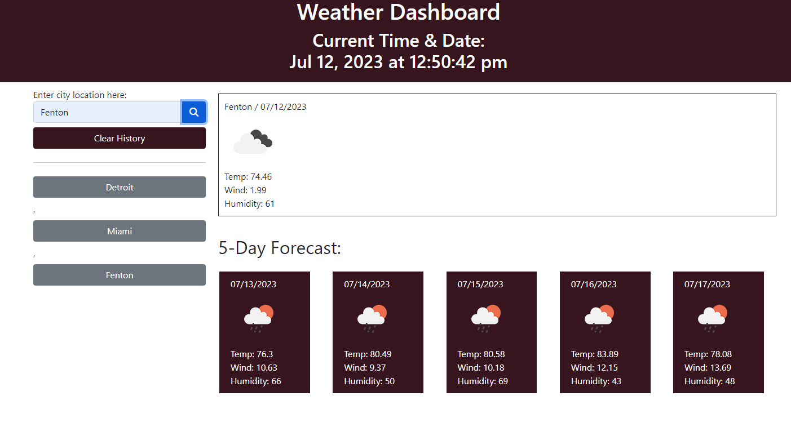

# Weathering-The-Storm
Five-day forecast weather dashboard

## Description
* This weather dashboard allows you to enter a city to see the local weather for that day as well as a five day forecast.
* It stores multiple locations so you can click on previously searched cities.
* It also allows you to clear the search history.

## Screenshot of page

## Link to page

## Installation
N/A

## Usage
* Enter the name of the city you would like to see the weather for. You will see current weather as well as the 5-day forecast. If entering multiple cities, previously search city names are stored for your convience. If you wish, you may clear the history using the clear history button. 

## Credits
https://openweathermap.org/api

https://getbootstrap.com

https://fontawesome.com/docs/apis/

https://day.js.org/

https://www.youtube.com/watch?v=ulT6Q-GqWbs

## License
Please refer to the License in the repository. 